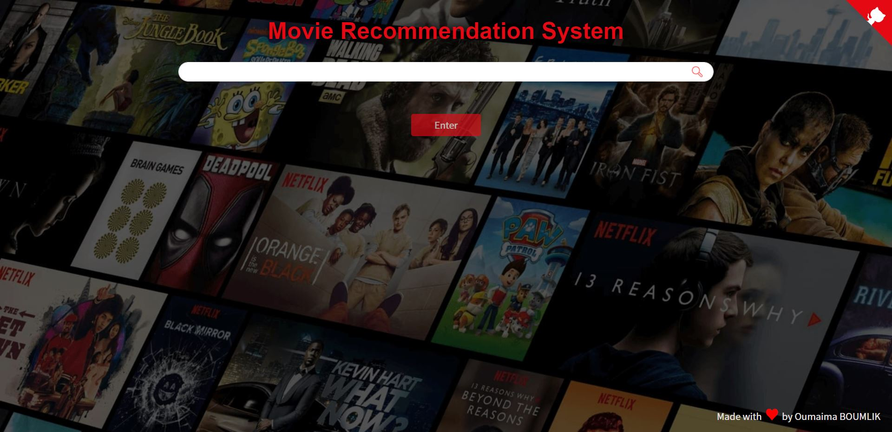

# Movies Recommendation System with Sentiment Analysis

## Project Description:
-A Content-Based Recommender System: Recommends movies similar to the movie user likes and provide further details on the chosen film.

-Sentiments Analysis: Based on the user's comments & reviews scrapped from the IMDB site using beautifulsoup4.

*NB* : The details of the movies(title, genre, runtime, rating, poster, etc) are fetched using an API by TMDB(https://www.themoviedb.org/documentation/api), and using the IMDB id of the movie in the API.
 
 ==> To get your API Key: Create an account in https://www.themoviedb.org/, click on the `API` link from the left hand sidebar in your account settings and fill all the details to apply for API key.

   
  
## Demo: 
   
   

## How to run the App?

1. Install all the libraries mentioned in the requirements.txt file.
2. Clone this repository in your local system.
3. Replace YOUR_API_KEY in the `static/recommend.js` file.
4. Open the command prompt from your project directory and run the command `python main.py`.
5. Go to your browser and type `http://127.0.0.1:5000/` in the address bar.

### Sources of the datasets 

1. [IMDB 5000 Movie Dataset](https://www.kaggle.com/carolzhangdc/imdb-5000-movie-dataset)
2. [The Movies Dataset](https://www.kaggle.com/rounakbanik/the-movies-dataset)
3. [List of movies in 2018](https://en.wikipedia.org/wiki/List_of_American_films_of_2018)
4. [List of movies in 2019](https://en.wikipedia.org/wiki/List_of_American_films_of_2019)
5. [List of movies in 2020](https://en.wikipedia.org/wiki/List_of_American_films_of_2020)

### Contact ME :)

[linkedin](https://www.linkedin.com/in/oumaima-boumlik-732066159/?locale=en_US)    

[Medium](https://medium.com/@boumlikoumaima)
